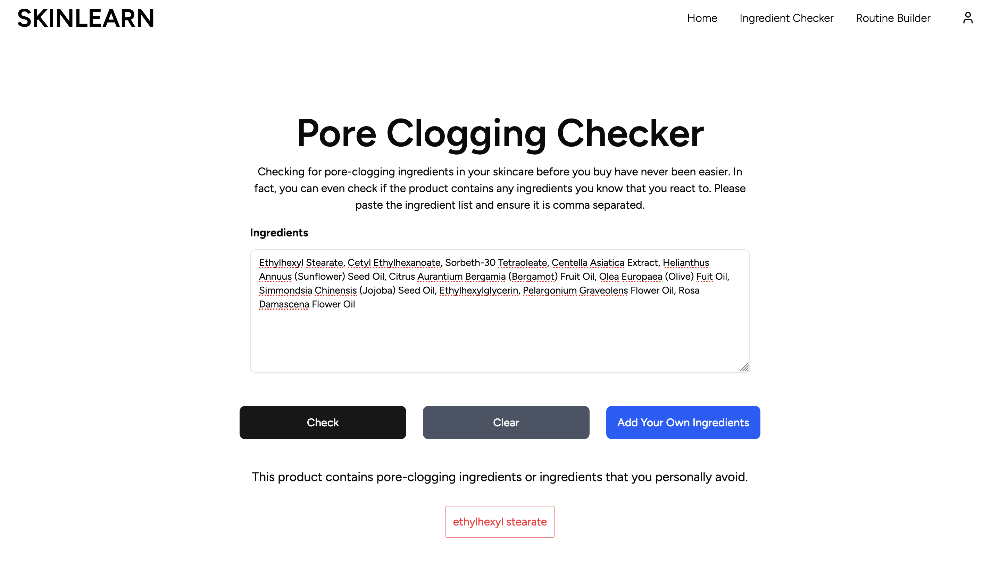
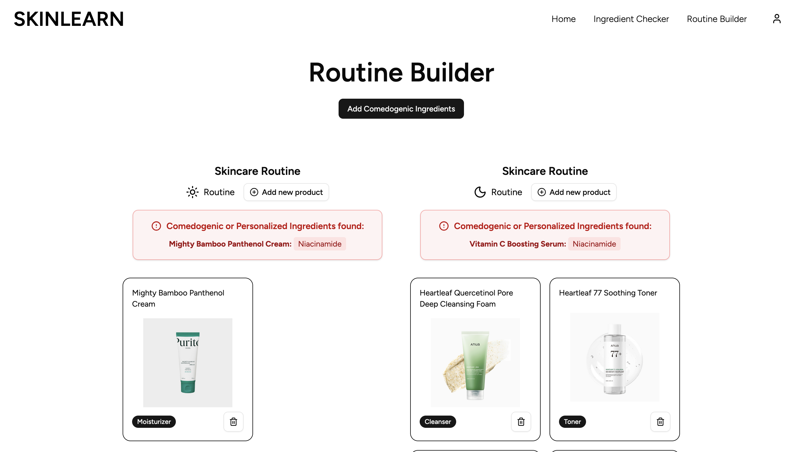

# skinlearn

Skinlearn is a full-stack web application designed for users who are concerned with their skin and their day and night routine, catering towards those who are prone to comedogenic/commonly known harmful ingredients, or are aware of ingredients that they react to themselves.

## Overview

Skinlearn hopes to support those who want to achieve better skin through supporting 450+ of the most common harmful ingredients found in skincare products, and 150+ pre-populated products where you can build your skincare routine from, or you could create/submit a custom one if there is a specific one that isn't supported.

### Screenshots

## Tools

- React, TypeScript, Tailwind CSS
- Python, Django, PostgreSQL
